<div align="center">

# Cryptika: Complete Technical Reference

**A self hosted, end to end encrypted Android messenger with ephemeral sessions, encrypted voice calls, self destructing messages, and a cryptographically blind relay server.**

No passwords. No stored data. No metadata beyond connection timing.  
Identity is a locally generated Ed25519 keypair. Nothing else.

</div>

***

## Table of Contents

1. [What Is Cryptika](#1-what-is-cryptika)
2. [High Level System Architecture](#2-high-level-system-architecture)
3. [How The App Starts: First Launch Lifecycle](#3-how-the-app-starts-first-launch-lifecycle)
4. [Passwordless Entry Architecture: No Accounts, No Passwords](#4-passwordless-entry-architecture-no-accounts-no-passwords)
5. [Custom In App Secure Keyboard: System IME Blocked](#5-custom-in-app-secure-keyboard-system-ime-blocked)
6. [Identity Cryptosystem: Ed25519 Deep Dive](#6-identity-cryptosystem-ed25519-deep-dive)
7. [Contact Discovery: Username Based Ephemeral Pairing](#7-contact-discovery-username-based-ephemeral-pairing)
8. [Ephemeral Sessions: Five Phase Credential Architecture](#8-ephemeral-sessions-five-phase-credential-architecture)
9. [Adding a Contact: QR Exchange Flow](#9-adding-a-contact-qr-exchange-flow)
10. [Networking Layer: WebSocket Architecture](#10-networking-layer-websocket-architecture)
11. [Cryptographic Handshake: X25519 DH Step by Step](#11-cryptographic-handshake-x25519-dh-step-by-step)
12. [Hash Ratchet: Forward Secrecy Mechanism](#12-hash-ratchet-forward-secrecy-mechanism)
13. [Sending a Message: Complete Step by Step Pipeline](#13-sending-a-message-complete-step-by-step-pipeline)
14. [Receiving a Message: Complete Step by Step Pipeline](#14-receiving-a-message-complete-step-by-step-pipeline)
15. [Wire Packet Protocol: Byte Level Breakdown](#15-wire-packet-protocol-byte-level-breakdown)
16. [Encrypted Storage Architecture: Defense at Rest](#16-encrypted-storage-architecture-defense-at-rest)
17. [Message Expiry: Cryptographic Self Destruction](#17-message-expiry-cryptographic-self-destruction)
18. [Peer Disconnect: Automatic Session Destruction](#18-peer-disconnect-automatic-session-destruction)
19. [Auto Logout: Screen Off, Back, Home, Minimize](#19-auto-logout-screen-off-back-home-minimize)
20. [Per Chat Screenshot Blocking](#20-per-chat-screenshot-blocking)
21. [Real Time Encrypted Voice Calls: Full Protocol](#21-real-time-encrypted-voice-calls-full-protocol)
22. [Background Operation: Doze, Reconnect, Services](#22-background-operation-doze-reconnect-services)
23. [Blind Relay Server: Internal Architecture](#23-blind-relay-server-internal-architecture)
24. [Server REST API Reference](#24-server-rest-api-reference)
25. [Dependency Injection: Hilt Architecture](#25-dependency-injection-hilt-architecture)
26. [Database Schema: Tables, Migrations, Indexes](#26-database-schema-tables-migrations-indexes)
27. [Exhaustive Source Code Reference](#27-exhaustive-source-code-reference)
28. [Complete End to End Data Flow: Alice Sends Bob a Message](#28-complete-end-to-end-data-flow-alice-sends-bob-a-message)
29. [Threat Model and Security Analysis](#29-threat-model-and-security-analysis)
30. [Android Permissions Reference](#30-android-permissions-reference)
31. [Technology Stack Reference](#31-technology-stack-reference)
32. [Building, Running, and Configuring](#32-building-running-and-configuring)
33. [Docker Deployment Guide](#33-docker-deployment-guide)
34. [Operational Troubleshooting Guide](#34-operational-troubleshooting-guide)
35. [License](#35-license)
36. [Authors and Connect](#36-authors-and-connect)

***

## 1. What Is Cryptika

Cryptika is a fully open source, self hostable secure messenger for Android. The system operates on a zero trust foundation: the relay server must never be trusted.

Even if the relay server is compromised, seized, subpoenaed, or running malicious code, the adversary cannot decrypt message payloads, uncover identity links beyond transient IP timing, or forge packets. Every security invariant holds under full server compromise.

The server is cryptographically blind. It persists zero state to persistent storage, generates zero access logs, and purges in memory mappings rapidly. After two peers establish their initial message exchange, server side authentication credentials are burned permanently, leaving the server unaware of participant identities.

### Core Design Decisions

| Architectural Choice | Security Rationale |
|:---|:---|
| Passwordless Entry | No credentials to compromise, no centralized database to breach. A transient public handle suffices for initial connection. |
| Identity as Ed25519 Keypair | Identity is anchored in asymmetric mathematics, generated on device, and never leaves the hardware perimeter. |
| Custom In App Secure Keyboard | System input method editors frequently record keystrokes and transmit predictive telemetry. Cryptika isolates typing within the app sandbox. |
| Ephemeral Sessions | Chat sessions possess finite lifespans. Session termination triggers cryptographic erasure on endpoints and relay. |
| Five Phase Credential Burn | Server authentication records are destroyed upon first payload transmission, severing connection to persistent identity. |
| Cryptographically Blind Relay | No database engine, no disk writes, no access logs. Ephemeral buffers reside exclusively in RAM under strict TTL timers. |
| Random Pseudonym Display | Communication peers view randomly generated session pseudonyms; real user handles are omitted from wire packets. |
| Hash Ratchet per Session | Every message derives a unique cryptographic key through a one way SHA 256 chain, enforcing forward secrecy. |
| Hardware Keystore Keys per Message | Message records on disk are enveloped with unique hardware backed Android Keystore keys, preventing offline cold storage extraction. |
| Aggressive Auto Logout | Screen off events, back navigation, home gestures, or app switching invoke immediate zeroization and session destruction. |
| Peer Disconnect Wipe | Loss of peer connection immediately wipes local session state, message tables, and active ratchet chains on both sides. |
| Three Second Default Ephemeral TTL | Unread and read messages execute automatic self destruction sequences three seconds after receipt by default. |

***

## 2. High Level System Architecture

Cryptika segregates responsibilities across an untrusted blind relay server and hardened Android endpoints. Communication channels utilize WebSocket Secure connections transporting opaque binary packets.

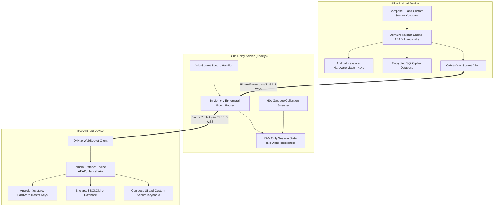
```mermaid
flowchart TB
    subgraph AliceDevice["Alice Android Device"]
        A_UI["Compose UI and Custom Secure Keyboard"]
        A_Domain["Domain: Ratchet Engine, AEAD, Handshake"]
        A_Keystore["Android Keystore: Hardware Master Keys"]
        A_Storage["Encrypted SQLCipher Database"]
        A_WS["OkHttp WebSocket Client"]
        A_UI --> A_Domain
        A_Domain --> A_Keystore
        A_Domain --> A_Storage
        A_Domain --> A_WS
    end

    subgraph RelayServer["Blind Relay Server (Node.js)"]
        S_WSS["WebSocket Secure Handler"]
        S_Router["In Memory Ephemeral Room Router"]
        S_Memory["RAM Only Session State (No Disk Persistence)"]
        S_Sweeper["60s Garbage Collection Sweeper"]
        S_WSS --> S_Router
        S_Router <--> S_Memory
        S_Sweeper --> S_Memory
    end

    subgraph BobDevice["Bob Android Device"]
        B_WS["OkHttp WebSocket Client"]
        B_Domain["Domain: Ratchet Engine, AEAD, Handshake"]
        B_Keystore["Android Keystore: Hardware Master Keys"]
        B_Storage["Encrypted SQLCipher Database"]
        B_UI["Compose UI and Custom Secure Keyboard"]
        B_WS --> B_Domain
        B_Domain --> B_Keystore
        B_Domain --> B_Storage
        B_Domain --> B_UI
    end

    A_WS <==>|Binary Packets via TLS 1.3 WSS| S_Router
    S_Router <==>|Binary Packets via TLS 1.3 WSS| B_WS
```

### Android Client Clean Architecture

The client follows strict Clean MVVM principles across Presentation, Domain, and Data tiers. High level components interact through well defined interfaces, isolating cryptographic engines from UI code.

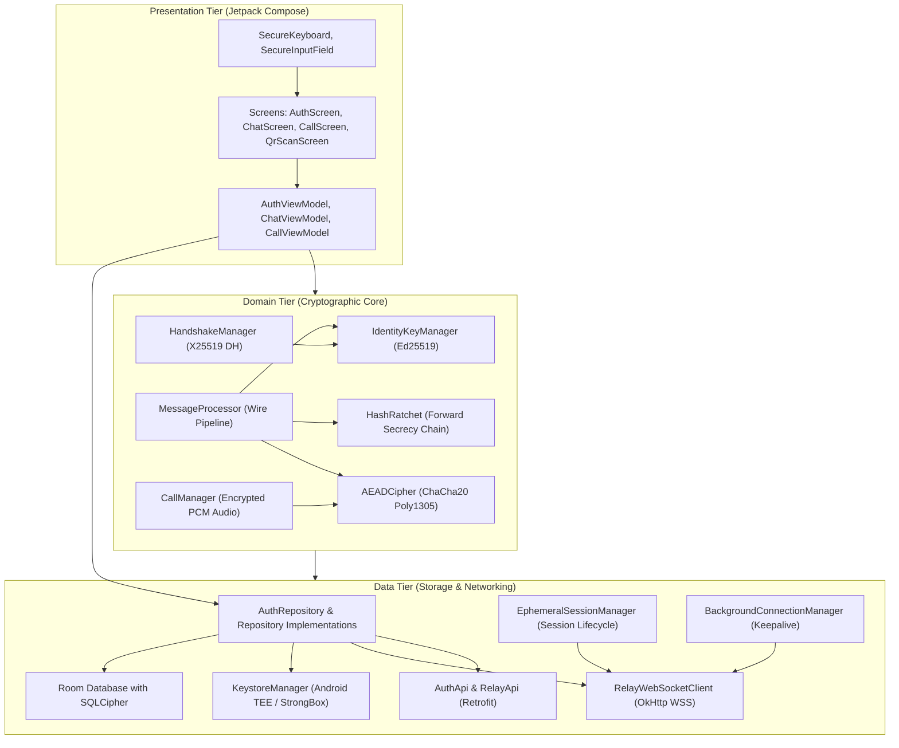
```mermaid
flowchart TD
    subgraph Presentation["Presentation Tier (Jetpack Compose)"]
        UI_Screens["Screens: AuthScreen, ChatScreen, CallScreen, QrScanScreen"]
        UI_Keyboard["SecureKeyboard, SecureInputField"]
        UI_VM["AuthViewModel, ChatViewModel, CallViewModel"]
        UI_Screens --> UI_VM
        UI_Keyboard --> UI_Screens
    end

    subgraph Domain["Domain Tier (Cryptographic Core)"]
        IKM["IdentityKeyManager (Ed25519)"]
        HM["HandshakeManager (X25519 DH)"]
        HR["HashRatchet (Forward Secrecy Chain)"]
        AEAD["AEADCipher (ChaCha20 Poly1305)"]
        MP["MessageProcessor (Wire Pipeline)"]
        CM["CallManager (Encrypted PCM Audio)"]
        MP --> HR
        MP --> AEAD
        MP --> IKM
        HM --> IKM
        CM --> AEAD
    end

    subgraph Data["Data Tier (Storage & Networking)"]
        Repo["AuthRepository & Repository Implementations"]
        DB["Room Database with SQLCipher"]
        KS["KeystoreManager (Android TEE / StrongBox)"]
        WS["RelayWebSocketClient (OkHttp WSS)"]
        ESM["EphemeralSessionManager (Session Lifecycle)"]
        BCM["BackgroundConnectionManager (Keepalive)"]
        API["AuthApi & RelayApi (Retrofit)"]
        Repo --> DB
        Repo --> KS
        Repo --> WS
        Repo --> API
        ESM --> WS
        BCM --> WS
    end

    UI_VM --> Domain
    UI_VM --> Repo
    Domain --> Data
```

### Component Isolation and Responsibilities

* Presentation Tier: Built entirely using Jetpack Compose with Material 3. Handles UI state rendering, user interaction, navigation, and renders the in app secure keyboard.
* Domain Tier: Pure Kotlin cryptographic logic completely isolated from Android SDK dependencies. Contains state machines for ratcheting, packet parsing, and signature verification.
* Data Tier: Implements repositories, local encrypted persistence using Room and SQLCipher, hardware key wrapping via AndroidKeyStore, and duplex WebSocket transport.

***

## 3. How The App Starts: First Launch Lifecycle

Application initialization verifies cryptographic integrity, instantiates hardware backed security material, initializes the local encrypted database, and registers system broadcast receivers for emergency auto logout.

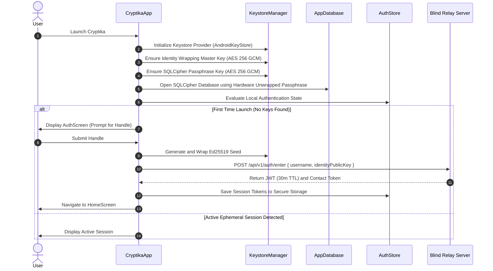
```mermaid
sequenceDiagram
    autonumber
    actor User
    participant App as CryptikaApp
    participant KS as KeystoreManager
    participant DB as AppDatabase
    participant Auth as AuthStore
    participant Server as Blind Relay Server

    User->>App: Launch Cryptika
    App->>KS: Initialize Keystore Provider (AndroidKeyStore)
    App->>KS: Ensure Identity Wrapping Master Key (AES 256 GCM)
    App->>KS: Ensure SQLCipher Passphrase Key (AES 256 GCM)
    App->>DB: Open SQLCipher Database using Hardware Unwrapped Passphrase
    App->>Auth: Evaluate Local Authentication State
    alt First Time Launch (No Keys Found)
        App->>User: Display AuthScreen (Prompt for Handle)
        User->>App: Submit Handle
        App->>KS: Generate and Wrap Ed25519 Seed
        App->>Server: POST /api/v1/auth/enter { username, identityPublicKey }
        Server-->>App: Return JWT (30m TTL) and Contact Token
        App->>Auth: Save Session Tokens to Secure Storage
        App->>User: Navigate to HomeScreen
    else Active Ephemeral Session Detected
        App->>User: Display Active Session
    end
```

### Lifecycle Implementation Details

* `CryptikaApp`: Derives from Android `Application`. Injects dependencies via Hilt, creates high priority notification channels, registers screen state broadcast receivers, and configures background connection observers.
* `MainActivity`: Applies `FLAG_SECURE` window attributes, observes navigation destinations, and coordinates foreground lifecycle transitions.
* `KeystoreManager`: Interacts directly with AndroidKeyStore inside Trusted Execution Environment or StrongBox Keymaster to safeguard root secrets.

***

## 4. Passwordless Entry Architecture: No Accounts, No Passwords

Cryptika dispenses entirely with traditional user account databases. There are no stored passwords, no verification emails, and no recovery phone numbers.

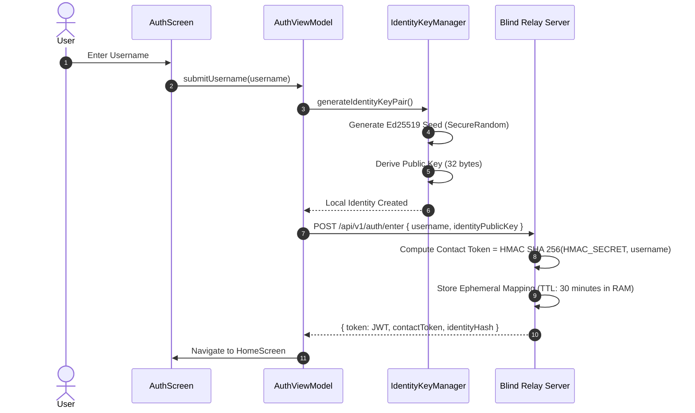
```mermaid
sequenceDiagram
    autonumber
    actor User
    participant UI as AuthScreen
    participant VM as AuthViewModel
    participant Crypto as IdentityKeyManager
    participant Server as Blind Relay Server

    User->>UI: Enter Username
    UI->>VM: submitUsername(username)
    VM->>Crypto: generateIdentityKeyPair()
    Crypto->>Crypto: Generate Ed25519 Seed (SecureRandom)
    Crypto->>Crypto: Derive Public Key (32 bytes)
    Crypto-->>VM: Local Identity Created
    VM->>Server: POST /api/v1/auth/enter { username, identityPublicKey }
    Server->>Server: Compute Contact Token = HMAC SHA 256(HMAC_SECRET, username)
    Server->>Server: Store Ephemeral Mapping (TTL: 30 minutes in RAM)
    Server-->>VM: { token: JWT, contactToken, identityHash }
    VM->>UI: Navigate to HomeScreen
```

### Security Characteristics of Passwordless Entry

* Zero Server Persistence: The server records the username, identity hash, and tokens purely within RAM. If the server process restarts, all authentication records vanish instantly.
* Anti Enumeration Design: Querying unregistered usernames yields identical response times to registered users, avoiding side channel handle enumeration.
* Deterministic Contact Token: Contact discovery uses a cryptographically blinded HMAC token derived from the handle, masking plaintext usernames during lookup operations.

***

## 5. Custom In App Secure Keyboard: System IME Blocked

Modern operating system keyboards present severe privacy vulnerabilities. Commercial IMEs frequently log keystrokes, transmit telemetry to cloud servers, update personal dictionaries, and sync clipboard caches across devices. Cryptika neutralizes this threat vector by blocking system keyboards entirely.

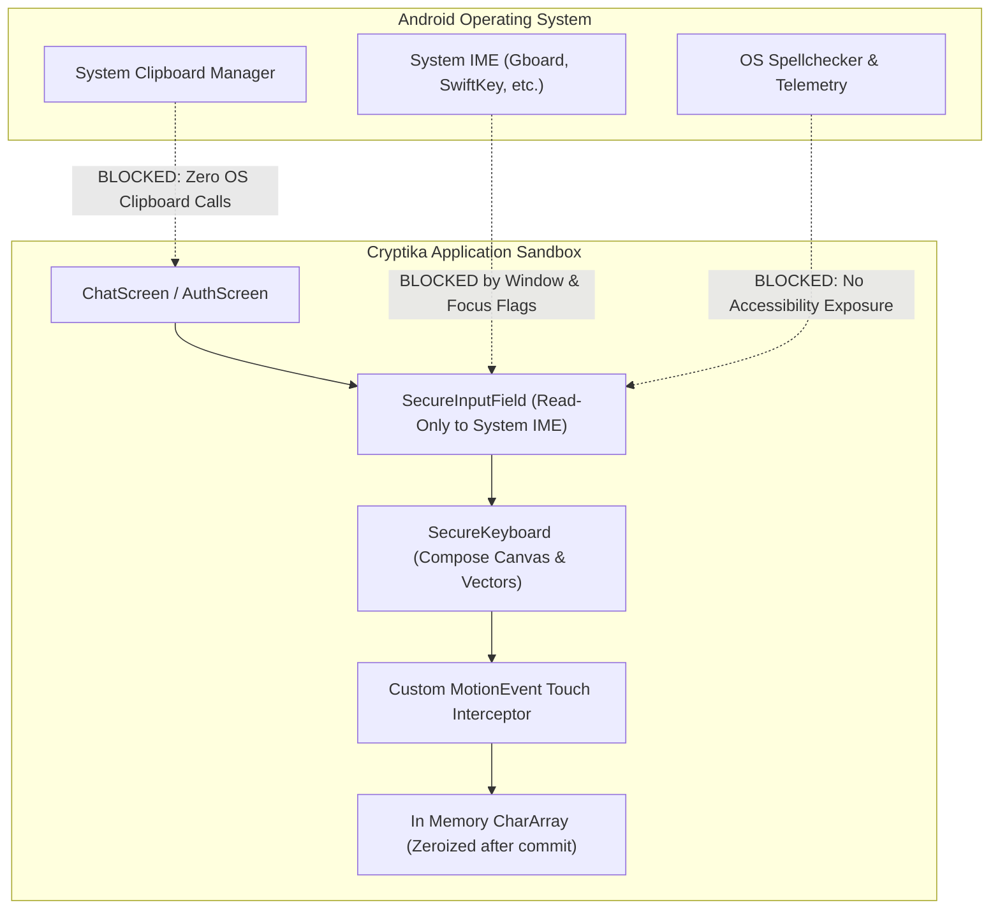
```mermaid
flowchart TD
    subgraph AndroidOS["Android Operating System"]
        OS_IME["System IME (Gboard, SwiftKey, etc.)"]
        OS_Clip["System Clipboard Manager"]
        OS_Spell["OS Spellchecker & Telemetry"]
    end

    subgraph CryptikaSandbox["Cryptika Application Sandbox"]
        Screen["ChatScreen / AuthScreen"]
        InputField["SecureInputField (Read-Only to System IME)"]
        TouchRouter["Custom MotionEvent Touch Interceptor"]
        SoftKey["SecureKeyboard (Compose Canvas & Vectors)"]
        Buffer["In Memory CharArray (Zeroized after commit)"]
        
        Screen --> InputField
        InputField --> SoftKey
        SoftKey --> TouchRouter
        TouchRouter --> Buffer
    end

    OS_IME -.->|BLOCKED by Window & Focus Flags| InputField
    OS_Clip -.->|BLOCKED: Zero OS Clipboard Calls| Screen
    OS_Spell -.->|BLOCKED: No Accessibility Exposure| InputField
```

### Keyboard Defense Mechanisms

* Focus Interception: Input fields configure `readOnly = true` on `BasicTextField`, denying the Android `InputMethodManager` permission to raise the system keyboard.
* Hardware Level Isolation: Key characters are mapped directly from raw pointer coordinates within Jetpack Compose into local memory buffers.
* Memory Zeroization: Buffer contents maintain data in transient primitive arrays (`CharArray`), overwritten with zeroes immediately upon payload transmission.
* Accessibility Masking: Sensitive text nodes omit accessibility label bindings, preventing malicious accessibility services from reading typed content.

***

## 6. Identity Cryptosystem: Ed25519 Deep Dive

User identity in Cryptika is represented exclusively by a locally generated Edwards curve digital signature algorithm (Ed25519) keypair over Curve25519.

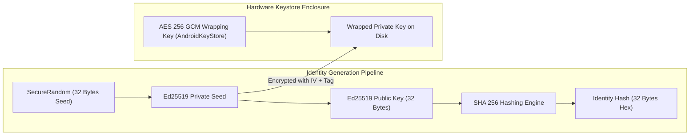
```mermaid
flowchart LR
    subgraph KeyGen["Identity Generation Pipeline"]
        RNG["SecureRandom (32 Bytes Seed)"] --> EdSeed["Ed25519 Private Seed"]
        EdSeed --> EdPub["Ed25519 Public Key (32 Bytes)"]
        EdPub --> SHA["SHA 256 Hashing Engine"]
        SHA --> Fingerprint["Identity Hash (32 Bytes Hex)"]
    end

    subgraph KeyProtection["Hardware Keystore Enclosure"]
        MasterKey["AES 256 GCM Wrapping Key (AndroidKeyStore)"]
        EdSeed -->|"Encrypted with IV + Tag"| WrappedBlob["Wrapped Private Key on Disk"]
        MasterKey --> WrappedBlob
    end
```

### Cryptographic Guarantees

* Curve Parameters: Ed25519 operates over the twisted Edwards curve `ax^2 + y^2 = 1 + dx^2y^2` over prime field `2^255 minus 19`.
* Collision Resistance: Signatures provide 128 bit security resistance against standard collision and preimage attacks.
* Identity Fingerprint: The user identity fingerprint equals `SHA256(Ed25519_Public_Key)`, represented as a 64 character hexadecimal string.
* Hardware Protection: Private seed bytes are wrapped inside AndroidKeyStore using AES 256 GCM before writing to the local database, preventing cold device extraction even on rooted hardware.

***

## 7. Contact Discovery: Username Based Ephemeral Pairing

Users establish communication without exposing their permanent identities through a dual ticket handshake protocol.

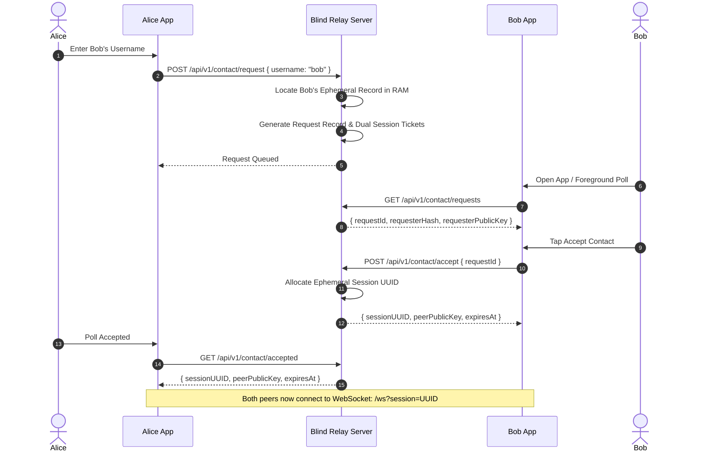
```mermaid
sequenceDiagram
    autonumber
    actor Alice
    participant A_App as Alice App
    participant Server as Blind Relay Server
    participant B_App as Bob App
    actor Bob

    Alice->>A_App: Enter Bob's Username
    A_App->>Server: POST /api/v1/contact/request { username: "bob" }
    Server->>Server: Locate Bob's Ephemeral Record in RAM
    Server->>Server: Generate Request Record & Dual Session Tickets
    Server-->>A_App: Request Queued
    Bob->>B_App: Open App / Foreground Poll
    B_App->>Server: GET /api/v1/contact/requests
    Server-->>B_App: { requestId, requesterHash, requesterPublicKey }
    Bob->>B_App: Tap Accept Contact
    B_App->>Server: POST /api/v1/contact/accept { requestId }
    Server->>Server: Allocate Ephemeral Session UUID
    Server-->>B_App: { sessionUUID, peerPublicKey, expiresAt }
    Alice->>A_App: Poll Accepted
    A_App->>Server: GET /api/v1/contact/accepted
    Server-->>A_App: { sessionUUID, peerPublicKey, expiresAt }
    Note over A_App, B_App: Both peers now connect to WebSocket: /ws?session=UUID
```

### Contact Request and Discovery Lifecycle FSM

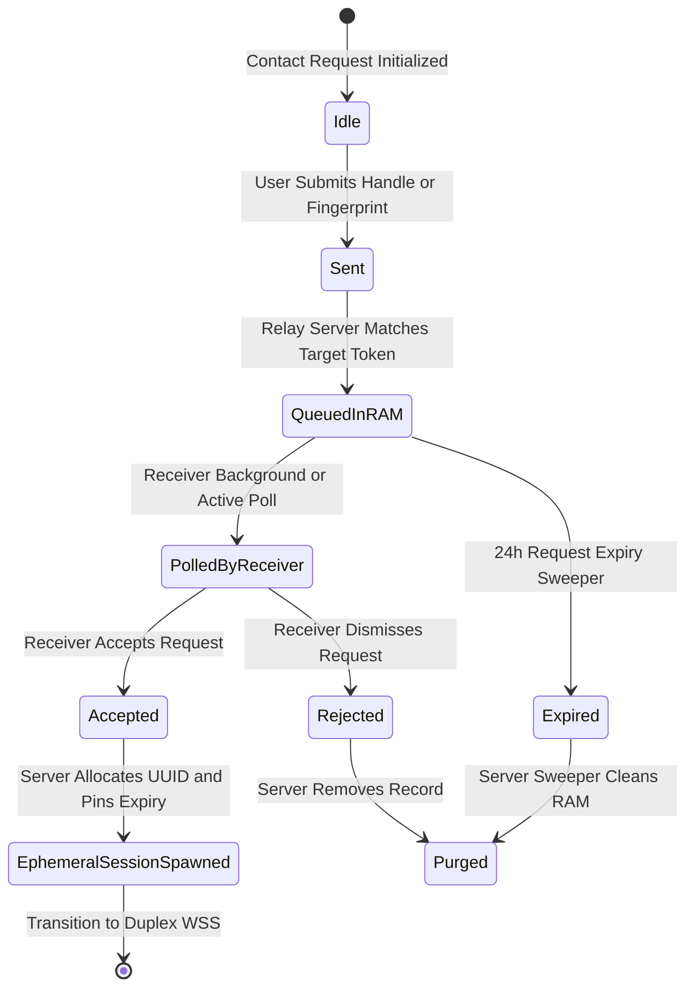
```mermaid
stateDiagram-v2
    [*] --> Idle: Contact Request Initialized
    Idle --> Sent: User Submits Handle or Fingerprint
    Sent --> QueuedInRAM: Relay Server Matches Target Token
    QueuedInRAM --> PolledByReceiver: Receiver Background or Active Poll
    PolledByReceiver --> Accepted: Receiver Accepts Request
    PolledByReceiver --> Rejected: Receiver Dismisses Request
    QueuedInRAM --> Expired: 24h Request Expiry Sweeper
    Rejected --> Purged: Server Removes Record
    Expired --> Purged: Server Sweeper Cleans RAM
    Accepted --> EphemeralSessionSpawned: Server Allocates UUID and Pins Expiry
    EphemeralSessionSpawned --> [*]: Transition to Duplex WSS
```

### Discovery Security Attributes

* Zero Public Directory: The server never returns a list of active users. Queries must specify an exact handle match.
* Dual Ticket Validation: Both parties verify tickets cryptographically signed by the server before key agreement proceeds.
* One Time Rendezvous: Contact pairing records dissolve once the session connects, preventing correlation across repeat sessions.

***

## 8. Ephemeral Sessions: Five Phase Credential Architecture

Sessions transition through five distinct phases to guarantee that relay infrastructure preserves zero long term forensic artifacts.

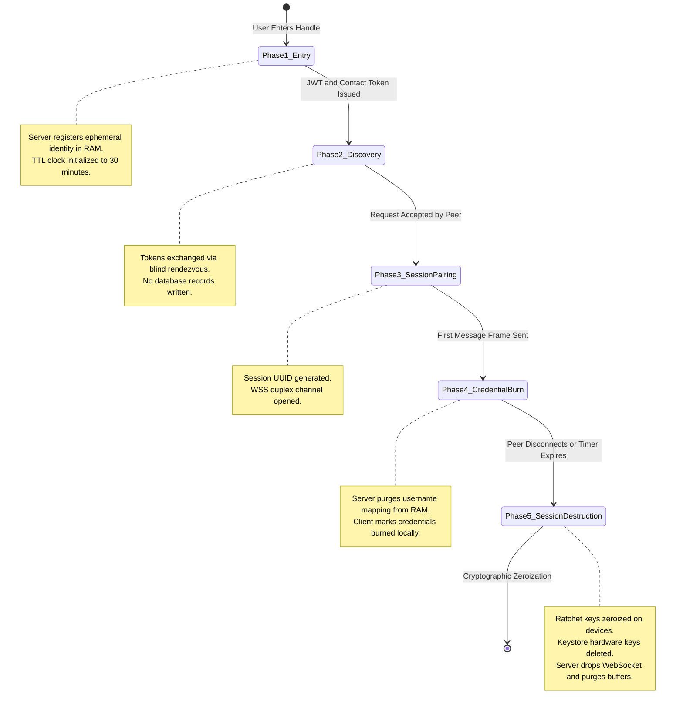
```mermaid
stateDiagram-v2
    [*] --> Phase1_Entry: User Enters Handle
    Phase1_Entry --> Phase2_Discovery: JWT and Contact Token Issued
    Phase2_Discovery --> Phase3_SessionPairing: Request Accepted by Peer
    Phase3_SessionPairing --> Phase4_CredentialBurn: First Message Frame Sent
    Phase4_CredentialBurn --> Phase5_SessionDestruction: Peer Disconnects or Timer Expires
    Phase5_SessionDestruction --> [*]: Cryptographic Zeroization

    note right of Phase1_Entry
        Server registers ephemeral identity in RAM.
        TTL clock initialized to 30 minutes.
    end note

    note right of Phase2_Discovery
        Tokens exchanged via blind rendezvous.
        No database records written.
    end note

    note right of Phase3_SessionPairing
        Session UUID generated.
        WSS duplex channel opened.
    end note

    note right of Phase4_CredentialBurn
        Server purges username mapping from RAM.
        Client marks credentials burned locally.
    end note

    note right of Phase5_SessionDestruction
        Ratchet keys zeroized on devices.
        Keystore hardware keys deleted.
        Server drops WebSocket and purges buffers.
    end note
```

### Five Phase Breakdown

1. Phase 1 Entry: User provides a transient handle. Server provisions a 30 minute scoped JWT and generates a contact token.
2. Phase 2 Discovery: Handshake occurs out of band or via ephemeral handle matching. Server facilitates ticket generation.
3. Phase 3 Session Pairing: Both endpoints join the dedicated ephemeral room (`/ws?session=<UUID>`).
4. Phase 4 Credential Burn: Upon dispatch of the first encrypted wire packet, the client triggers `POST /api/v1/auth/burn`. The server deletes the username mapping completely from RAM. Subsequent queries for that username report 404 Not Found.
5. Phase 5 Session Destruction: When either peer disconnects, the server transmits `0xFF 0xFE PEER_DISCONNECTED`, tears down the room, and flushes all transient queues. Both clients execute memory zeroization and purge local message rows.

***

## 9. Adding a Contact: QR Exchange Flow

For peer to peer exchange without using username discovery over the network, Cryptika provides an offline QR code exchange protocol.

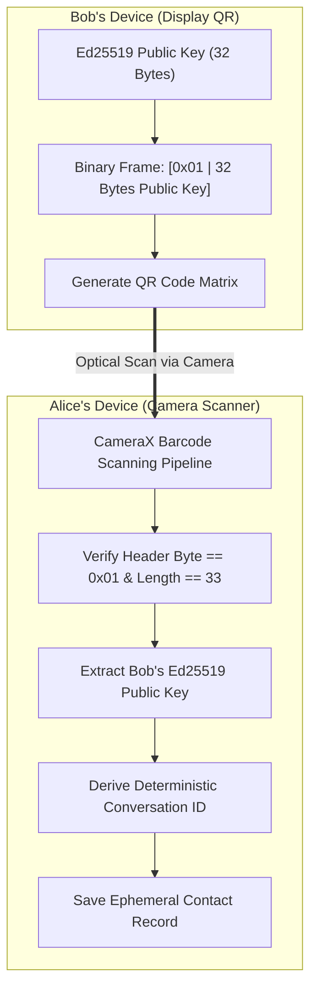
```mermaid
flowchart TD
    subgraph BobQR["Bob's Device (Display QR)"]
        B_Key["Ed25519 Public Key (32 Bytes)"]
        B_Payload["Binary Frame: [0x01 | 32 Bytes Public Key]"]
        B_Encode["Generate QR Code Matrix"]
        B_Key --> B_Payload --> B_Encode
    end

    subgraph AliceScan["Alice's Device (Camera Scanner)"]
        A_Cam["CameraX Barcode Scanning Pipeline"]
        A_Parse["Verify Header Byte == 0x01 & Length == 33"]
        A_Extract["Extract Bob's Ed25519 Public Key"]
        A_Derive["Derive Deterministic Conversation ID"]
        A_Save["Save Ephemeral Contact Record"]
        A_Cam --> A_Parse --> A_Extract --> A_Derive --> A_Save
    end

    B_Encode ==>|Optical Scan via Camera| A_Cam
```

### QR Payload Encoding

* Header Byte: `0x01` (denoting protocol version 1).
* Key Payload: 32 raw bytes of Ed25519 public key.
* Total Size: Exactly 33 bytes, rendering a minimal, dense QR code that scans instantly in low light environments.
* Deterministic Conversation Identifier: `conv_` concatenated with hex representation of `SHA256(min(pubKeyA, pubKeyB) || max(pubKeyA, pubKeyB))`.

***

## 10. Networking Layer: WebSocket Architecture

Network transport uses an encrypted, duplex WebSocket Secure channel over TLS 1.3.

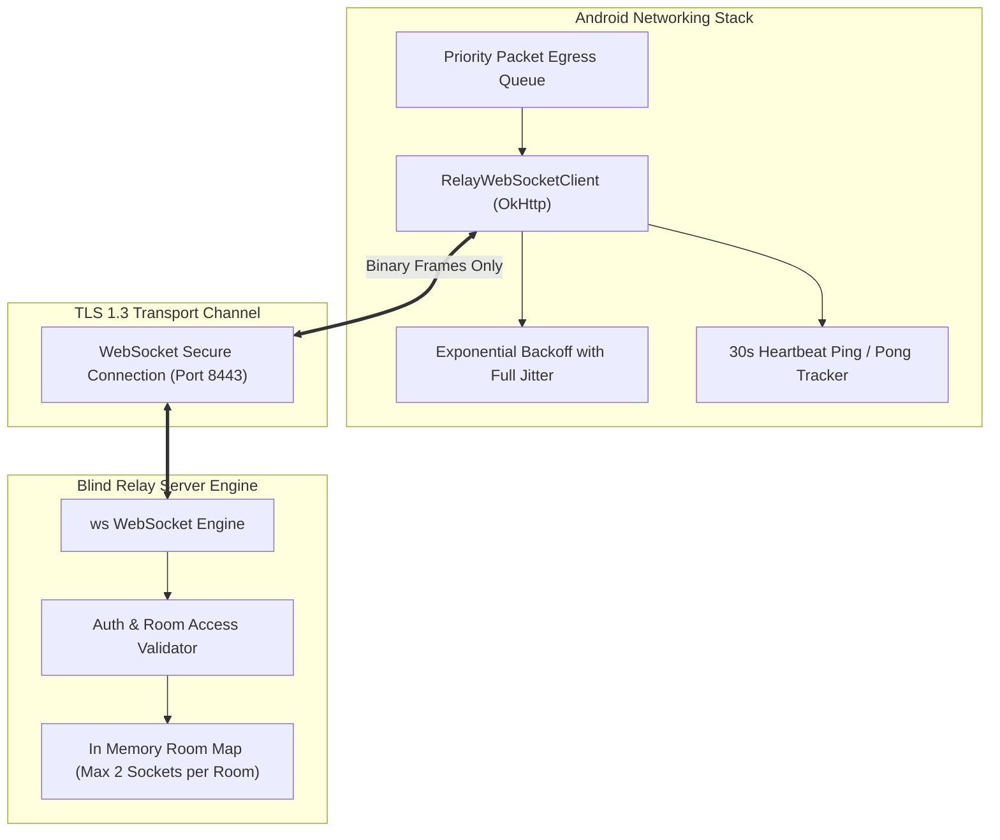
```mermaid
flowchart TD
    subgraph ClientNetworking["Android Networking Stack"]
        RelayWS["RelayWebSocketClient (OkHttp)"]
        Backoff["Exponential Backoff with Full Jitter"]
        Pinger["30s Heartbeat Ping / Pong Tracker"]
        PacketQueue["Priority Packet Egress Queue"]
        
        RelayWS --> Backoff
        RelayWS --> Pinger
        PacketQueue --> RelayWS
    end

    subgraph WireChannel["TLS 1.3 Transport Channel"]
        WSS["WebSocket Secure Connection (Port 8443)"]
    end

    subgraph ServerNetworking["Blind Relay Server Engine"]
        WSS_Server["ws WebSocket Engine"]
        ConnGuard["Auth & Room Access Validator"]
        RoomMap["In Memory Room Map (Max 2 Sockets per Room)"]
        
        WSS_Server --> ConnGuard --> RoomMap
    end

    RelayWS <==>|Binary Frames Only| WSS <==> WSS_Server
```

### WebSocket Connection and Backoff Reconnection FSM

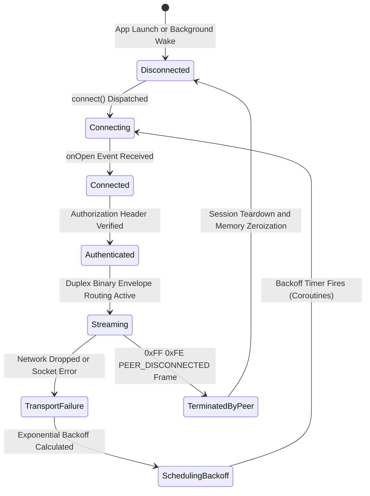
```mermaid
stateDiagram-v2
    [*] --> Disconnected: App Launch or Background Wake
    Disconnected --> Connecting: connect() Dispatched
    Connecting --> Connected: onOpen Event Received
    Connected --> Authenticated: Authorization Header Verified
    Authenticated --> Streaming: Duplex Binary Envelope Routing Active
    Streaming --> TransportFailure: Network Dropped or Socket Error
    Streaming --> TerminatedByPeer: 0xFF 0xFE PEER_DISCONNECTED Frame
    TransportFailure --> SchedulingBackoff: Exponential Backoff Calculated
    SchedulingBackoff --> Connecting: Backoff Timer Fires (Coroutines)
    TerminatedByPeer --> Disconnected: Session Teardown and Memory Zeroization
```

### Network Resilience Mechanisms

* Binary Only Framing: Text frames are strictly rejected with close code `4004 (Binary only)`, preventing UTF 8 injection or parsing vulnerabilities.
* Exponential Backoff with Jitter: Reconnection delays follow `min(30s, base * 2^attempt) + random_jitter`, preventing thundering herd load spikes on server recovery.
* Ephemeral Connection Watchdog: Heartbeat pings execute every 30 seconds. A missing pong response within 10 seconds triggers immediate connection reset.

***

## 11. Cryptographic Handshake: X25519 DH Step by Step

Before message exchange begins, peers execute an authenticated Diffie Hellman key agreement using ephemeral Curve25519 keys, cross signed by their Ed25519 identity keys.

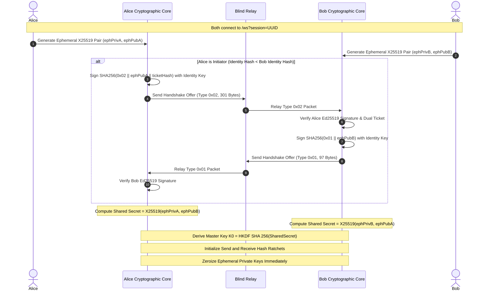
```mermaid
sequenceDiagram
    autonumber
    actor Alice
    participant A_Crypto as Alice Cryptographic Core
    participant Server as Blind Relay
    participant B_Crypto as Bob Cryptographic Core
    actor Bob

    Note over Alice, Bob: Both connect to /ws?session=UUID
    Alice->>A_Crypto: Generate Ephemeral X25519 Pair (ephPrivA, ephPubA)
    Bob->>B_Crypto: Generate Ephemeral X25519 Pair (ephPrivB, ephPubB)

    alt Alice is Initiator (Identity Hash < Bob Identity Hash)
        A_Crypto->>A_Crypto: Sign SHA256(0x02 || ephPubA || ticketHash) with Identity Key
        A_Crypto->>Server: Send Handshake Offer (Type 0x02, 301 Bytes)
        Server->>B_Crypto: Relay Type 0x02 Packet
        B_Crypto->>B_Crypto: Verify Alice Ed25519 Signature & Dual Ticket
        B_Crypto->>B_Crypto: Sign SHA256(0x01 || ephPubB) with Identity Key
        B_Crypto->>Server: Send Handshake Offer (Type 0x01, 97 Bytes)
        Server->>A_Crypto: Relay Type 0x01 Packet
        A_Crypto->>A_Crypto: Verify Bob Ed25519 Signature
    end

    Note over A_Crypto: Compute Shared Secret = X25519(ephPrivA, ephPubB)
    Note over B_Crypto: Compute Shared Secret = X25519(ephPrivB, ephPubA)
    Note over A_Crypto, B_Crypto: Derive Master Key K0 = HKDF SHA 256(SharedSecret)
    Note over A_Crypto, B_Crypto: Initialize Send and Receive Hash Ratchets
    Note over A_Crypto, B_Crypto: Zeroize Ephemeral Private Keys Immediately
```

### Handshake Packet Structure

* Type 0x01 (97 Bytes): Acceptor handshake offer containing magic byte `0x01`, 32 byte ephemeral public key, and 64 byte Ed25519 signature over `SHA256(0x01 || ephPub)`.
* Type 0x02 (301 Bytes): Initiator handshake offer containing magic byte `0x02`, 32 byte ephemeral public key, 64 byte Ed25519 signature over `SHA256(0x02 || ephPub || ticketHash)`, and the 204 byte dual signed ticket.

***

## 12. Hash Ratchet: Forward Secrecy Mechanism

Forward secrecy is guaranteed through symmetric key hash ratcheting. Every transmitted and received message steps an independent SHA 256 hash chain, producing a single use key that is zeroized immediately after encryption or decryption.

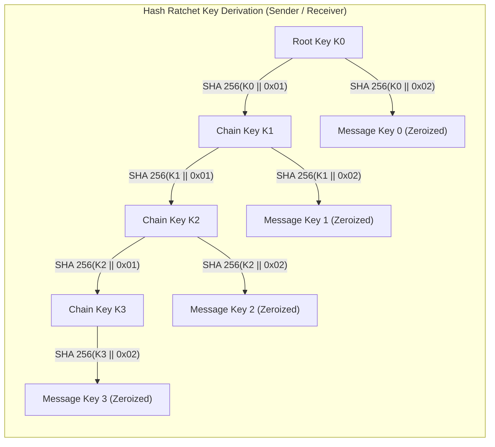
```mermaid
flowchart LR
    subgraph RatchetChain["Hash Ratchet Key Derivation (Sender / Receiver)"]
        K0["Root Key K0"] -->|"SHA 256(K0 || 0x01)"| K1["Chain Key K1"]
        K1 -->|"SHA 256(K1 || 0x01)"| K2["Chain Key K2"]
        K2 -->|"SHA 256(K2 || 0x01)"| K3["Chain Key K3"]

        K0 -->|"SHA 256(K0 || 0x02)"| M0["Message Key 0 (Zeroized)"]
        K1 -->|"SHA 256(K1 || 0x02)"| M1["Message Key 1 (Zeroized)"]
        K2 -->|"SHA 256(K2 || 0x02)"| M2["Message Key 2 (Zeroized)"]
        K3 -->|"SHA 256(K3 || 0x02)"| M3["Message Key 3 (Zeroized)"]
    end
```

### Out of Order Handling via Lookahead Buffer

Mobile networks frequently reorder or delay packets. Cryptika implements a deterministic lookahead cache:

* Lookahead Window: Supports stepping forward up to 32 ratchet cycles ahead of the current counter.
* Ephemeral Buffer: Skipped message keys are cached in memory with a strict 30 second time to live.
* Instant Destruction: Once a late packet arrives and decrypts, its cached key is overwritten with zeroes and excised from memory.

***

## 13. Sending a Message: Complete Step by Step Pipeline

Transmitting a message involves header assembly, deterministic nonce generation, authenticated encryption, asymmetric signing, and framing.

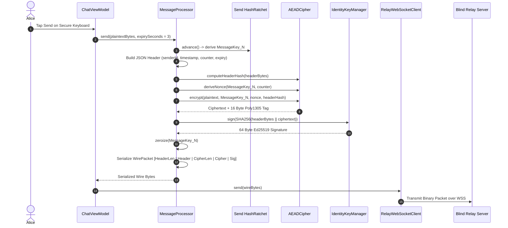
```mermaid
sequenceDiagram
    autonumber
    actor Alice
    participant VM as ChatViewModel
    participant MP as MessageProcessor
    participant HR as Send HashRatchet
    participant AEAD as AEADCipher
    participant IKM as IdentityKeyManager
    participant WS as RelayWebSocketClient
    participant Relay as Blind Relay Server

    Alice->>VM: Tap Send on Secure Keyboard
    VM->>MP: send(plaintextBytes, expirySeconds = 3)
    MP->>HR: advance() -> derive MessageKey_N
    MP->>MP: Build JSON Header (senderId, timestamp, counter, expiry)
    MP->>AEAD: computeHeaderHash(headerBytes)
    MP->>AEAD: deriveNonce(MessageKey_N, counter)
    MP->>AEAD: encrypt(plaintext, MessageKey_N, nonce, headerHash)
    AEAD-->>MP: Ciphertext + 16 Byte Poly1305 Tag
    MP->>IKM: sign(SHA256(headerBytes || ciphertext))
    IKM-->>MP: 64 Byte Ed25519 Signature
    MP->>MP: zeroize(MessageKey_N)
    MP->>MP: Serialize WirePacket [HeaderLen | Header | CipherLen | Cipher | Sig]
    MP-->>VM: Serialized Wire Bytes
    VM->>WS: send(wireBytes)
    WS->>Relay: Transmit Binary Packet over WSS
```

### Pipeline Steps in Detail

1. Ratchet Advance: Send ratchet advances one step to derive the single use `MessageKey_N`.
2. Header Generation: Metadata frame is assembled containing sender identity hash, millisecond timestamp, sequential ratchet counter, and message expiry window.
3. Associated Data Binding: SHA 256 digest of header bytes binds as AEAD additional authenticated data, preventing header tampering.
4. Nonce Derivation: Nonce equals `SHA256(MessageKey || Counter)[0..11]`, eliminating random IV collision risk.
5. AEAD Encryption: Payload encrypts via ChaCha20 Poly1305, outputting ciphertext and a 16 byte MAC tag.
6. Identity Signature: Ed25519 signs `SHA256(HeaderBytes || Ciphertext)` to prove origin authenticity.
7. Key Zeroization: Primitive array holding `MessageKey_N` is overwritten with zeroes.

***

## 14. Receiving a Message: Complete Step by Step Pipeline

Receiving client enforces strict ordering and rejection rules. A single validation failure aborts execution and drops the packet.

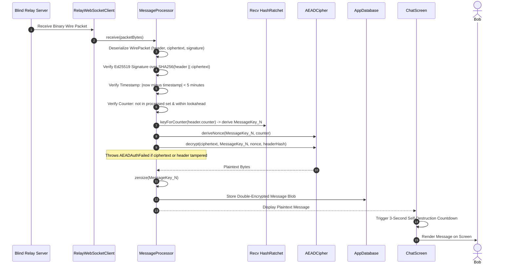
```mermaid
sequenceDiagram
    autonumber
    participant Relay as Blind Relay Server
    participant WS as RelayWebSocketClient
    participant MP as MessageProcessor
    participant HR as Recv HashRatchet
    participant AEAD as AEADCipher
    participant DB as AppDatabase
    participant UI as ChatScreen
    actor Bob

    Relay->>WS: Receive Binary Wire Packet
    WS->>MP: receive(packetBytes)
    MP->>MP: Deserialize WirePacket (header, ciphertext, signature)
    MP->>MP: Verify Ed25519 Signature over SHA256(header || ciphertext)
    MP->>MP: Verify Timestamp: |now minus timestamp| < 5 minutes
    MP->>MP: Verify Counter: not in processed set & within lookahead
    MP->>HR: keyForCounter(header.counter) -> derive MessageKey_N
    MP->>AEAD: deriveNonce(MessageKey_N, counter)
    MP->>AEAD: decrypt(ciphertext, MessageKey_N, nonce, headerHash)
    Note over MP: Throws AEADAuthFailed if ciphertext or header tampered
    AEAD-->>MP: Plaintext Bytes
    MP->>MP: zeroize(MessageKey_N)
    MP->>DB: Store Double-Encrypted Message Blob
    MP-->>UI: Display Plaintext Message
    UI->>UI: Trigger 3-Second Self-Destruction Countdown
    UI->>Bob: Render Message on Screen
```

***

## 15. Wire Packet Protocol: Byte Level Breakdown

All data over the wire is packed into compact, big endian binary envelopes.

### Message Packet Layout

| Offset (Bytes) | Field Name | Data Type | Description |
|:---|:---|:---|:---|
| 0 .. 3 | Header Length | Big Endian Int32 | Length `H` of the serialized JSON header |
| 4 .. (3 + H) | Header Payload | UTF 8 JSON String | JSON structure: `sid`, `ts`, `ctr`, `exp`, `type` |
| (4 + H) .. (7 + H) | Ciphertext Length | Big Endian Int32 | Length `C` of encrypted payload including MAC tag |
| (8 + H) .. (7 + H + C) | Ciphertext Payload | Binary Bytes | ChaCha20 ciphertext + 16 byte Poly1305 tag |
| (8 + H + C) .. End | Digital Signature | Binary 64 Bytes | Ed25519 signature over `SHA256(Header \|\| Ciphertext)` |

### Handshake Offer Packet Layouts

#### Type 0x01 Handshake (97 Bytes Fixed Size)
| Offset (Bytes) | Field Name | Size | Value / Description |
|:---|:---|:---|:---|
| 0 | Packet Magic | 1 Byte | `0x01` (Acceptor Handshake Type) |
| 1 .. 32 | Ephemeral Public Key | 32 Bytes | Curve25519 public key generated for this session |
| 33 .. 96 | Ed25519 Signature | 64 Bytes | Signature over `SHA256(0x01 \|\| EphemeralPublicKey)` |

#### Type 0x02 Handshake with Ticket (301 Bytes Fixed Size)
| Offset (Bytes) | Field Name | Size | Value / Description |
|:---|:---|:---|:---|
| 0 | Packet Magic | 1 Byte | `0x02` (Initiator Handshake Type) |
| 1 .. 32 | Ephemeral Public Key | 32 Bytes | Curve25519 public key generated for this session |
| 33 .. 96 | Ed25519 Signature | 64 Bytes | Signature over `SHA256(0x02 \|\| EphemPub \|\| TicketHash)` |
| 97 .. 300 | Dual Signed Ticket | 204 Bytes | Server issued dual ticket validating session |

### Voice Call Packets Layout

#### Call Signal Packet (122 Bytes Fixed Size)
| Offset (Bytes) | Field Name | Size | Description |
|:---|:---|:---|:---|
| 0 | Magic Byte | 1 Byte | `0x02` (CALL_SIGNAL magic identifier) |
| 1 | Signal Type | 1 Byte | `0x01` OFFER, `0x02` ANSWER, `0x03` REJECT, `0x04` HANGUP, `0x05` BUSY |
| 2 .. 17 | Call Identifier | 16 Bytes | Random UUID byte array identifying call instance |
| 18 .. 25 | Timestamp | 8 Bytes | Big endian Int64 timestamp (anti replay skew check) |
| 26 .. 57 | Ephemeral Key | 32 Bytes | X25519 public key (zeroed for REJECT/HANGUP/BUSY) |
| 58 .. 121 | Ed25519 Signature | 64 Bytes | Signature over `SHA256(bytes[0..57])` |

#### Audio Frame Packet (353 Bytes Fixed Size)
| Offset (Bytes) | Field Name | Size | Description |
|:---|:---|:---|:---|
| 0 | Magic Byte | 1 Byte | `0x03` (AUDIO_FRAME magic identifier) |
| 1 .. 4 | Sequence Counter | 4 Bytes | Big endian Int32 frame index |
| 5 .. 16 | Frame Nonce | 12 Bytes | `SHA256(directionKey \|\| seqBytes)[0..11]` |
| 17 .. 336 | Encrypted Audio | 320 Bytes | ChaCha20 encrypted 160 sample 16-bit PCM voice chunk |
| 337 .. 352 | Poly1305 Tag | 16 Bytes | Authentication tag protecting audio frame |

### Control Frames

* Peer Disconnect Frame: 19 bytes consisting of prefix `0xFF 0xFE` followed by ASCII characters `PEER_DISCONNECTED`.

***

## 16. Encrypted Storage Architecture: Defense at Rest

Data at rest applies two independent layers of hardware backed encryption, defeating offline database dumps even when an attacker achieves physical device extraction or kernel root.

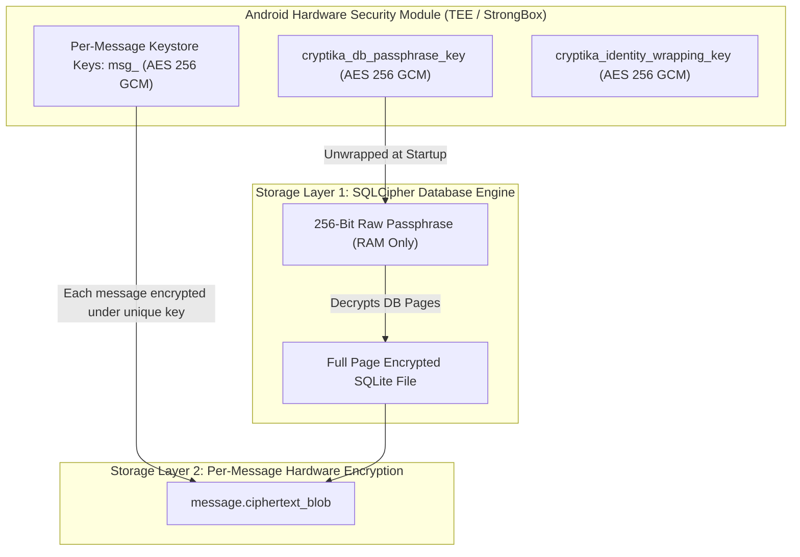
```mermaid
flowchart TD
    subgraph HardwareBoundary["Android Hardware Security Module (TEE / StrongBox)"]
        DBKey["cryptika_db_passphrase_key (AES 256 GCM)"]
        MsgKeyPool["Per-Message Keystore Keys: msg_<UUID> (AES 256 GCM)"]
        IdKey["cryptika_identity_wrapping_key (AES 256 GCM)"]
    end

    subgraph SQLCipherLayer["Storage Layer 1: SQLCipher Database Engine"]
        UnwrappedPass["256-Bit Raw Passphrase (RAM Only)"]
        DBKey -->|"Unwrapped at Startup"| UnwrappedPass
        UnwrappedPass -->|"Decrypts DB Pages"| PageEngine["Full Page Encrypted SQLite File"]
    end

    subgraph PayloadLayer["Storage Layer 2: Per-Message Hardware Encryption"]
        MsgKeyPool -->|"Each message encrypted under unique key"| MsgBlobs["message.ciphertext_blob"]
    end

    PageEngine --> MsgBlobs
```

### Two Tier Defense Model

1. Tier 1 Page Encryption: The entire SQLite database file is encrypted on disk by SQLCipher using a 256 bit key. The passphrase is never stored in plaintext; it is wrapped by an AES 256 GCM master key located in AndroidKeyStore.
2. Tier 2 Individual Message Enveloping: Each message record inserted into the database is independently encrypted under its own dedicated hardware key `msg_<uuid>`. Even if an attacker dumps the decrypted SQLCipher database from memory, all message contents remain unreadable ciphertext without individual access to the AndroidKeyStore hardware crypto module.

***

## 17. Message Expiry: Cryptographic Self Destruction

Messages self destruct through a three step cryptographic shredding routine.

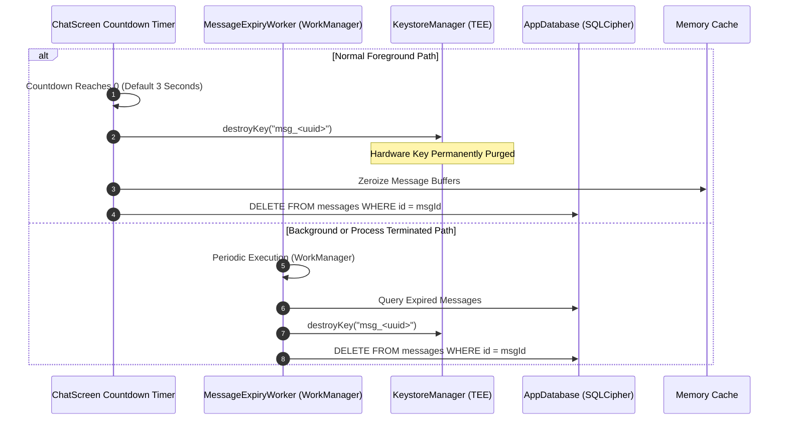
```mermaid
sequenceDiagram
    autonumber
    participant UI as ChatScreen Countdown Timer
    participant Worker as MessageExpiryWorker (WorkManager)
    participant KS as KeystoreManager (TEE)
    participant DB as AppDatabase (SQLCipher)
    participant Mem as Memory Cache

    alt Normal Foreground Path
        UI->>UI: Countdown Reaches 0 (Default 3 Seconds)
        UI->>KS: destroyKey("msg_<uuid>")
        Note over KS: Hardware Key Permanently Purged
        UI->>Mem: Zeroize Message Buffers
        UI->>DB: DELETE FROM messages WHERE id = msgId
    else Background or Process Terminated Path
        Worker->>Worker: Periodic Execution (WorkManager)
        Worker->>DB: Query Expired Messages
        Worker->>KS: destroyKey("msg_<uuid>")
        Worker->>DB: DELETE FROM messages WHERE id = msgId
    end
```

### Three Step Destruction Protocol

1. Hardware Key Destruction: The app commands AndroidKeyStore to delete the alias `msg_<uuid>`. Once this key is deleted, the ciphertext stored on flash memory becomes mathematically impossible to decrypt.
2. Memory Overwrite: Plaintext message strings and backing byte arrays are overwritten with zeroes (`fill(0)`).
3. Database Purge: The SQLite row is deleted, and SQLite executes space reclamation routines.

***

## 18. Peer Disconnect: Automatic Session Destruction

When a user closes their app, switches networks, or loses connection, the server and clients coordinate immediate local state shredding.

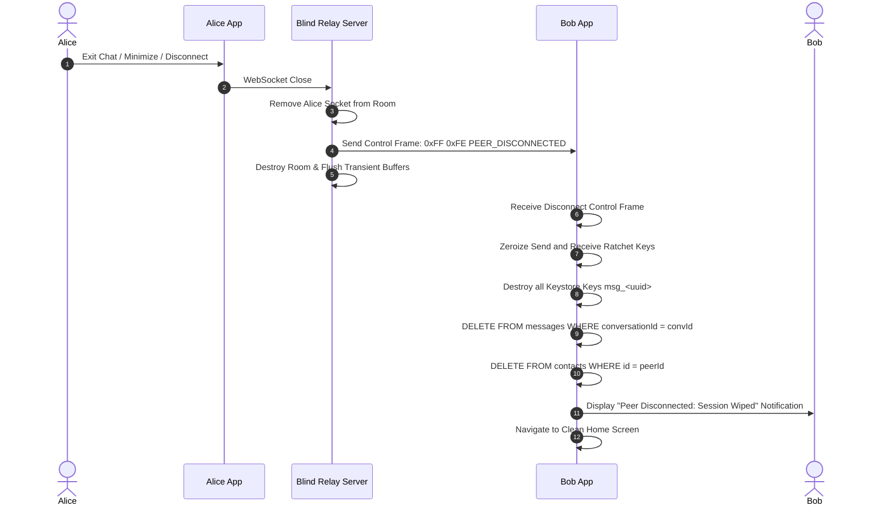
```mermaid
sequenceDiagram
    autonumber
    actor Alice
    participant A_App as Alice App
    participant Server as Blind Relay Server
    participant B_App as Bob App
    actor Bob

    Alice->>A_App: Exit Chat / Minimize / Disconnect
    A_App->>Server: WebSocket Close
    Server->>Server: Remove Alice Socket from Room
    Server->>B_App: Send Control Frame: 0xFF 0xFE PEER_DISCONNECTED
    Server->>Server: Destroy Room & Flush Transient Buffers
    B_App->>B_App: Receive Disconnect Control Frame
    B_App->>B_App: Zeroize Send and Receive Ratchet Keys
    B_App->>B_App: Destroy all Keystore Keys msg_<uuid>
    B_App->>B_App: DELETE FROM messages WHERE conversationId = convId
    B_App->>B_App: DELETE FROM contacts WHERE id = peerId
    B_App->>Bob: Display "Peer Disconnected: Session Wiped" Notification
    B_App->>B_App: Navigate to Clean Home Screen
```

***

## 19. Auto Logout: Screen Off, Back, Home, Minimize

To protect users against physical device theft or forced inspection, Cryptika terminates active sessions whenever the device moves out of the active foreground state.

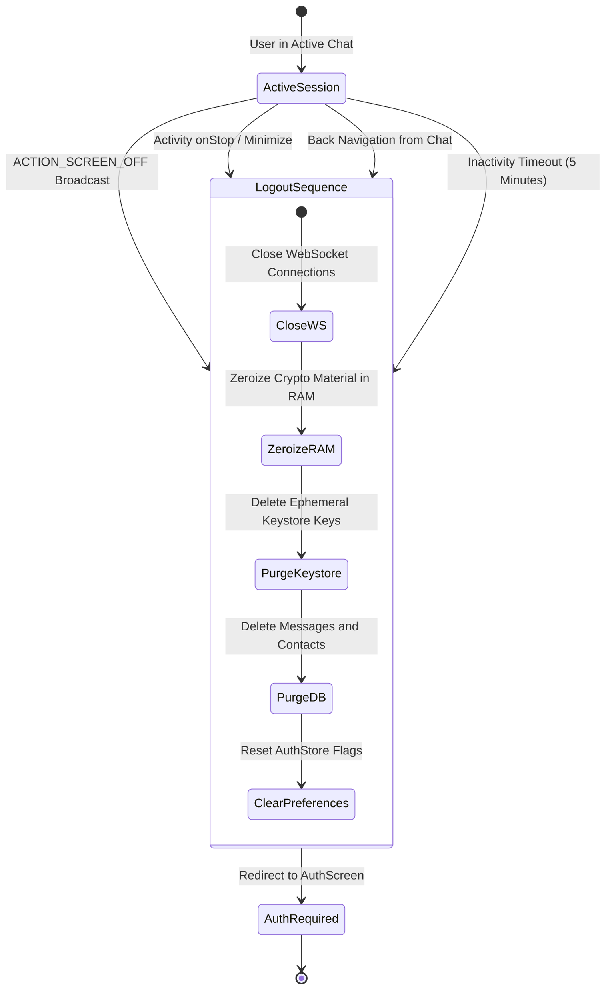
```mermaid
stateDiagram-v2
    [*] --> ActiveSession: User in Active Chat
    ActiveSession --> LogoutSequence: ACTION_SCREEN_OFF Broadcast
    ActiveSession --> LogoutSequence: Activity onStop / Minimize
    ActiveSession --> LogoutSequence: Back Navigation from Chat
    ActiveSession --> LogoutSequence: Inactivity Timeout (5 Minutes)

    state LogoutSequence {
        [*] --> CloseWS: Close WebSocket Connections
        CloseWS --> ZeroizeRAM: Zeroize Crypto Material in RAM
        ZeroizeRAM --> PurgeKeystore: Delete Ephemeral Keystore Keys
        PurgeKeystore --> PurgeDB: Delete Messages and Contacts
        PurgeDB --> ClearPreferences: Reset AuthStore Flags
    }

    LogoutSequence --> AuthRequired: Redirect to AuthScreen
    AuthRequired --> [*]
```

### Monitored Logout Triggers

* Screen Off Broadcast: A dynamic `BroadcastReceiver` captures `Intent.ACTION_SCREEN_OFF`. Locking the device triggers immediate session annihilation.
* Activity Lifecycle Transitions: Moving the app to the background triggers `onStop()`, invoking the logout sequence.
* Back Navigation: Pressing the system back button exits the conversation and purges transient keys.

***

## 20. Per Chat Screenshot Blocking

Cryptika isolates sensitive screens from Android OS screen capture, accessibility scraping, and recent apps preview caching.

### Window Security Enforcement

* `FLAG_SECURE` Integration: Screens configure the window flag:
  ```kotlin
  window.setFlags(
      WindowManager.LayoutParams.FLAG_SECURE,
      WindowManager.LayoutParams.FLAG_SECURE
  )
  ```
* Recent Apps Thumbnail Protection: Android OS task manager displays a blank screen preview instead of sensitive chat conversation content.
* Screen Recording Invalidation: Screen recordings capture black frames over the application window.
* Dynamic Scoping: Chat and call screens enforce security flags continuously during lifecycle execution.

***

## 21. Real Time Encrypted Voice Calls: Full Protocol

Cryptika features real time, end to end encrypted voice calling over the existing relay infrastructure without requiring third party signaling servers.

```mermaid
sequenceDiagram
    autonumber
    actor Caller
    participant C_Audio as Caller Audio Engine (16kHz PCM)
    participant C_Call as Caller CallManager
    participant Relay as Blind Relay Server
    participant E_Call as Callee CallManager
    participant E_Audio as Callee Audio Engine (16kHz PCM)
    actor Callee

    Caller->>C_Call: Start Voice Call
    C_Call->>C_Call: Generate Ephemeral X25519 Pair (callPrivC, callPubC)
    C_Call->>Relay: Send CALL_SIGNAL Offer (Type 0x02, Signal 0x01)
    Relay->>E_Call: Relay Signal Packet
    E_Call->>Callee: Ringing Notification
    Callee->>E_Call: Accept Call
    E_Call->>E_Call: Generate Ephemeral X25519 Pair (callPrivE, callPubE)
    E_Call->>Relay: Send CALL_SIGNAL Answer (Type 0x02, Signal 0x02)
    Relay->>C_Call: Relay Signal Packet

    Note over C_Call, E_Call: Compute Shared Secret = X25519(callPriv, peerPub)
    Note over C_Call, E_Call: Derive callerEncKey & calleeEncKey via SHA 256

    loop Bidirectional Audio Streaming (100 Frames per Second)
        C_Audio->>C_Call: Record 320 Bytes PCM (10ms, 16-bit mono 16kHz)
        C_Call->>C_Call: ChaCha20 Poly1305 Encrypt with callerEncKey
        C_Call->>Relay: Send AUDIO_FRAME (Type 0x03, 353 Bytes)
        Relay->>E_Call: Relay Audio Frame
        E_Call->>E_Call: ChaCha20 Poly1305 Decrypt with callerEncKey
        E_Call->>E_Audio: Play 320 Bytes PCM via AudioTrack
    end
```

### Voice Call Lifecycle State Machine (FSM)

```mermaid
stateDiagram-v2
    [*] --> Idle: Call Engine Ready
    Idle --> OutgoingRinging: startCall() dispatched / OFFER sent
    Idle --> IncomingRinging: OFFER received from peer
    OutgoingRinging --> Active: ANSWER signal received
    OutgoingRinging --> Idle: Cancelled by caller or Ring Timeout (60s)
    IncomingRinging --> Active: answerCall() / ANSWER signal sent
    IncomingRinging --> Idle: rejectCall() / REJECT or BUSY sent
    Active --> Idle: hangup() / HANGUP signal dispatched
    Active --> Idle: HANGUP signal received from peer
    Active --> Idle: Audio Watchdog Timeout (30s peer silence)
    Active --> Idle: Peer Disconnect Frame
```

### Voice Call Audio Specifications

* Audio Format: 16 000 Hz sample rate, 16 bit mono linear PCM.
* Frame Size: 160 audio samples per frame (exactly 10 milliseconds of audio), corresponding to 320 raw bytes.
* Low Latency Framing: 100 frames transmitted per second, minimizing buffer lag.
* Direction Specific Keys:
  * `callerEncKey = SHA256(sharedSecret || "caller_send" || callId)`
  * `calleeEncKey = SHA256(sharedSecret || "callee_send" || callId)`
  Directional keys prevent nonce reuse when both endpoints run synchronized sequence counters starting from zero.

***

## 22. Background Operation: Doze, Reconnect, Services

Cryptika ensures connectivity without compromising security through foreground services and battery optimization handlers.

```mermaid
flowchart TD
    subgraph AndroidSystem["Android OS Power & Connectivity"]
        Doze["Android Doze Mode State"]
        NetMonitor["ConnectivityManager Network Callback"]
    end

    subgraph ServiceLayer["Cryptika Foreground Services"]
        MsgService["ConnectionForegroundService (remoteMessaging)"]
        CallService["CallForegroundService (microphone)"]
        Notif["Minimal System Status Notification"]
        
        MsgService --> Notif
        CallService --> Notif
    end

    subgraph ConnectionCore["Connection Management"]
        BCM["BackgroundConnectionManager"]
        RelayWS["RelayWebSocketClient"]
        
        BCM --> RelayWS
    end

    Doze -.->|State Transitions| BCM
    NetMonitor -->|Network Available / Lost| BCM
    MsgService --> BCM
    CallService --> BCM
```

### Foreground Service Execution

* `ConnectionForegroundService`: Runs with `foregroundServiceType="remoteMessaging"`, maintaining WebSocket state with minimal silent notifications.
* `CallForegroundService`: Runs with `foregroundServiceType="microphone"`, keeping audio capture pipelines active during background call operations.

***

## 23. Blind Relay Server: Internal Architecture

The server is built in Node.js using native ES modules, `ws`, TweetNaCl, and Helmet. It operates as a blind switchboard.

```mermaid
flowchart TD
    subgraph ServerRuntime["Node.js Server Process (RAM Only)"]
        HTTP["Express HTTP Server (Helmet Guarded)"]
        WSS["ws WebSocket Server"]
        
        subgraph EphemeralMemory["Ephemeral RAM Data Structures"]
            Users["users Map (Username -> Token, IdentityHash)"]
            Requests["contactRequests Map (Pending Discovery)"]
            Sessions["ephemeralSessions Map (Session UUID -> Peers)"]
            Sockets["conversationSockets Map (Active WebSockets)"]
            Buffers["messageBuffer Map (Transient Delivery Queues)"]
        end

        subgraph SweeperRoutines["Automated Garbage Collectors"]
            Timer60["60-Second Active Sweeper Interval"]
            Burner["Credential Burn Handler"]
            CloseHandler["Socket Termination Routine"]
        end

        HTTP --> EphemeralMemory
        WSS --> EphemeralMemory
        Timer60 --> EphemeralMemory
        Burner --> EphemeralMemory
        CloseHandler --> EphemeralMemory
    end
```

### Blind Relay Operational Guarantees

* Zero Database Engines: The server contains no PostgreSQL, MySQL, MongoDB, or SQLite dependencies.
* Zero Filesystem Writes: Message payloads, user records, and network logs are never written to disk.
* 60 Second Sweeper: An interval timer executes every 60 seconds, evicting expired sessions, stale tickets, and dangling socket mappings.

***

## 24. Server REST API Reference

All REST endpoints operate under `/api/v1` and communicate via JSON envelopes.

### Endpoints Overview

| Method | Endpoint | Authentication | Description |
|:---|:---|:---|:---|
| `GET` | `/health` | None | Service liveness probe, version, and runtime statistics |
| `POST` | `/api/v1/auth/enter` | None | Ephemeral handle registration, contact token issuance, JWT creation |
| `POST` | `/api/v1/auth/burn` | Bearer JWT | Immediately purges caller handle and tokens from RAM |
| `POST` | `/api/v1/contact/request` | Bearer JWT | Dispatches contact pairing request by target username |
| `POST` | `/api/v1/contact/request-by-fingerprint` | Bearer JWT | Dispatches contact pairing request by identity fingerprint |
| `GET` | `/api/v1/contact/requests` | Bearer JWT | Queries pending incoming contact requests |
| `POST` | `/api/v1/contact/accept` | Bearer JWT | Accepts contact request and provisions ephemeral session |
| `POST` | `/api/v1/contact/reject` | Bearer JWT | Rejects and deletes pending contact request |
| `GET` | `/api/v1/contact/accepted` | Bearer JWT | Polls status of dispatched contact requests |
| `POST` | `/api/v1/ticket` | Bearer JWT | Issues dual signed rendezvous ticket |
| `POST` | `/api/v1/presence` | Bearer JWT | Updates transient presence status |
| `GET` | `/api/v1/presence/:hash` | None | Queries transient presence status for identity hash |

### Endpoint Specifications

#### 1. Service Health: `GET /health`
* Purpose: Verifies server availability and reports transient operational metrics.
* Success Response (200 OK):
  ```json
  {
    "status": "ok",
    "version": "3.0.0",
    "activeUsers": 12,
    "activeSessions": 6,
    "uptimeSeconds": 1420
  }
  ```

#### 2. User Entry: `POST /api/v1/auth/enter`
* Headers: `Content-Type: application/json`
* Request Body:
  ```json
  {
    "username": "alice",
    "identityPublicKey": "base64EncodedEd25519PublicKey"
  }
  ```
* Success Response (200 OK):
  ```json
  {
    "token": "eyJhbGciOiJIUzI1NiIsInR5cCI6IkpXVCJ9...",
    "contactToken": "8f4a1...hexEncodedContactToken",
    "identityHash": "e3b0c44298fc1c149afbf4c8996fb92427ae41e4649b934ca495991b7852b855",
    "expiresAt": 1790856000000
  }
  ```

#### 3. Burn Credentials: `POST /api/v1/auth/burn`
* Headers: `Authorization: Bearer <JWT>`
* Purpose: Purges username mapping from server memory upon initial message exchange.
* Success Response (200 OK):
  ```json
  {
    "burned": true
  }
  ```

#### 4. Contact Request: `POST /api/v1/contact/request`
* Headers: `Authorization: Bearer <JWT>`
* Request Body:
  ```json
  {
    "username": "bob"
  }
  ```
* Success Response (200 OK):
  ```json
  {
    "requestId": "4fa81cb0-c20f-48d9-81fc-582386ef8e3e",
    "status": "pending"
  }
  ```

#### 5. Accept Request: `POST /api/v1/contact/accept`
* Headers: `Authorization: Bearer <JWT>`
* Request Body:
  ```json
  {
    "requestId": "4fa81cb0-c20f-48d9-81fc-582386ef8e3e"
  }
  ```
* Success Response (200 OK):
  ```json
  {
    "sessionUUID": "c85d0d61-3995-46aa-a979-9941a8775f0f",
    "peerPublicKey": "base64EncodedEd25519PublicKey",
    "expiresAt": 1790857800000
  }
  ```

### Server Rate Limiting Rules

* Entry Endpoint: Limited to 10 requests per client IP per minute.
* Contact Request Endpoint: Limited to 10 requests per client IP per minute and 20 requests per user handle per hour.

***

## 25. Dependency Injection: Hilt Architecture

Cryptika organizes dependencies through Google Dagger Hilt, ensuring deterministic component lifecycles and thread safe singleton instances.

```mermaid
flowchart TD
    subgraph AppModuleContainer["AppModule (SingletonComponent)"]
        AppDatabaseProvider["provideAppDatabase()"]
        KeystoreManagerProvider["provideKeystoreManager()"]
        IdentityKeyManagerProvider["provideIdentityKeyManager()"]
        SessionKeyManagerProvider["provideSessionKeyManager()"]
        OkHttpClientProvider["provideOkHttpClient()"]
        RetrofitProvider["provideRetrofit()"]
        AuthApiProvider["provideAuthApi()"]
        RelayApiProvider["provideRelayApi()"]
    end

    subgraph InjectedSingletons["Application Singletons"]
        AuthRepo["AuthRepositoryImpl"]
        ChatRepo["RepositoryImpl"]
        BCM["BackgroundConnectionManager"]
        ESM["EphemeralSessionManager"]
        CallMgr["CallManager"]
    end

    subgraph InjectedViewModels["Hilt ViewModels"]
        AuthVM["AuthViewModel"]
        ChatVM["ChatViewModel"]
        CallVM["CallViewModel"]
    end

    AppModuleContainer --> InjectedSingletons
    InjectedSingletons --> InjectedViewModels
```

### Unidirectional Data Flow and Clean Architecture Model

```mermaid
flowchart TD
    subgraph PresentationLayer["Presentation Layer (Jetpack Compose UI)"]
        UIScreens["Compose Screens (ChatScreen, AuthScreen, CallScreen)"]
        UIStateFlow["Immutable StateFlow (UI State)"]
        UserActions["User Tap and Intent Events"]
    end

    subgraph StateLayer["State Management Layer"]
        HiltVM["Hilt ViewModels (AuthViewModel, ChatViewModel, CallViewModel)"]
        VMScope["viewModelScope Coroutine Dispatchers"]
    end

    subgraph DomainLayer["Domain Layer (Cryptographic Engine)"]
        Ratchet["HashRatchet (Forward Secrecy Chain)"]
        Processor["MessageProcessor (Doom Principle and Signatures)"]
        HandshakeEngine["HandshakeManager and TicketManager (X25519 DH)"]
        VoiceState["CallManager Audio State Machine"]
    end

    subgraph DataLayer["Data Layer (Storage and Transport)"]
        Repos["Repository Implementations"]
        SQLCipherDB["Encrypted SQLCipher AppDatabase"]
        KeystoreModule["Android KeyStore (Per-Message AES-256-GCM)"]
        RelayWS["RelayWebSocketClient (Binary Framing and Reconnect)"]
        RESTModule["Retrofit AuthApi and RelayApi"]
    end

    UserActions --> HiltVM
    HiltVM --> VMScope
    VMScope --> DomainLayer
    DomainLayer --> Repos
    Repos --> SQLCipherDB
    Repos --> KeystoreModule
    Repos --> RelayWS
    Repos --> RESTModule
    SQLCipherDB --> Repos
    RelayWS --> Repos
    Repos --> HiltVM
    HiltVM --> UIStateFlow
    UIStateFlow --> UIScreens
```

### Dependency Graph Structure

* File: `app/src/main/java/com/cryptika/messenger/di/AppModule.kt`
* Annotations: Configured with `@Module` and `@InstallIn(SingletonComponent::class)`.
* Injected Services: All cryptographic managers, repository instances, Room databases, and network clients are provisioned as `@Singleton` bindings.
* Constructor Injection: ViewModels consume domain repositories and managers cleanly via `@HiltViewModel` annotations.

***

## 26. Database Schema: Tables, Migrations, Indexes

The client persistence layer utilizes Android Room over an encrypted SQLCipher backend.

### Database Tables Specification

#### 1. `contacts` Table
Stores paired contacts for active ephemeral sessions.
```sql
CREATE TABLE IF NOT EXISTS contacts (
    id TEXT PRIMARY KEY NOT NULL,
    nickname TEXT NOT NULL,
    publicKey TEXT NOT NULL,
    identityHash TEXT NOT NULL,
    conversationId TEXT NOT NULL,
    createdAt INTEGER NOT NULL,
    isEphemeral INTEGER NOT NULL DEFAULT 1,
    sessionUUID TEXT,
    sessionExpiresAt INTEGER
);
CREATE INDEX IF NOT EXISTS index_contacts_identityHash ON contacts(identityHash);
CREATE INDEX IF NOT EXISTS index_contacts_conversationId ON contacts(conversationId);
```

#### 2. `conversations` Table
Tracks active chat metadata.
```sql
CREATE TABLE IF NOT EXISTS conversations (
    id TEXT PRIMARY KEY NOT NULL,
    contactId TEXT NOT NULL,
    lastActivity INTEGER NOT NULL,
    sessionKey TEXT,
    createdAt INTEGER NOT NULL
);
CREATE INDEX IF NOT EXISTS index_conversations_contactId ON conversations(contactId);
```

#### 3. `messages` Table
Maintains encrypted message records. Payload data is double wrapped under hardware keys.
```sql
CREATE TABLE IF NOT EXISTS messages (
    id TEXT PRIMARY KEY NOT NULL,
    conversationId TEXT NOT NULL,
    senderId TEXT NOT NULL,
    ciphertext_blob BLOB NOT NULL,
    timestamp INTEGER NOT NULL,
    isIncoming INTEGER NOT NULL,
    isRead INTEGER NOT NULL DEFAULT 0,
    expirySeconds INTEGER NOT NULL DEFAULT 0,
    expiresAt INTEGER,
    deliveryStatus TEXT NOT NULL DEFAULT 'PENDING'
);
CREATE INDEX IF NOT EXISTS index_messages_conversationId ON messages(conversationId);
CREATE INDEX IF NOT EXISTS index_messages_expiresAt ON messages(expiresAt);
```

#### 4. `local_identity` Table
Maintains local identity keys wrapped under AndroidKeyStore master keys.
```sql
CREATE TABLE IF NOT EXISTS local_identity (
    id TEXT PRIMARY KEY NOT NULL,
    publicKeyBase64 TEXT NOT NULL,
    encryptedPrivateKeyBlob BLOB NOT NULL,
    identityHashHex TEXT NOT NULL,
    createdAt INTEGER NOT NULL
);
```

***

## 27. Exhaustive Source Code Reference

### Complete Component Breakdown

#### Application Layer
| Source File | Architectural Responsibility |
|:---|:---|
| `CryptikaApp.kt` | Subclasses Android Application with `@HiltAndroidApp`. Initializes notification channels, registers screen off receivers, and binds background connection observers. |
| `MainActivity.kt` | Host activity managing Compose navigation, enforcing `FLAG_SECURE`, and orchestrating auto logout sequences on `onStop()`. |

#### Dependency Injection
| Source File | Architectural Responsibility |
|:---|:---|
| `di/AppModule.kt` | Hilt Singleton module providing database instances, cryptographic managers, OkHttpClient, Retrofit APIs, and repositories. |

#### Domain: Cryptographic Core
| Source File | Architectural Responsibility |
|:---|:---|
| `domain/crypto/IdentityKeyManager.kt` | Ed25519 keypair generation, AndroidKeyStore wrapping, digital signature computation, and verification. |
| `domain/crypto/SessionKeyManager.kt` | Ephemeral Curve25519 keypair lifecycle, Diffie Hellman shared secret generation, HKDF master key derivation. |
| `domain/crypto/HandshakeManager.kt` | Dual ticket validation, 97 byte and 301 byte offer assembly, Ed25519 signature enforcement. |
| `domain/crypto/HashRatchet.kt` | Forward secrecy symmetric hash chains, out of order lookahead buffering, memory zeroization. |
| `domain/crypto/AEADCipher.kt` | ChaCha20 Poly1305 authenticated encryption with deterministic nonce derivation and header authentication binding. |
| `domain/crypto/TicketManager.kt` | Verification of dual signed server rendezvous tickets against pinned server public keys. |
| `domain/crypto/MessageProcessor.kt` | Complete wire frame packaging, signature verification, anti replay checks, and decryption pipeline. |

#### Domain: Models & Repository Contracts
| Source File | Architectural Responsibility |
|:---|:---|
| `domain/model/DomainModels.kt` | Core models including Contact, Message, Conversation, WirePacket, MessageHeader, and ConnectionState. |
| `domain/model/CallModels.kt` | Voice call state models including CallState, CallSignalType, and AudioPacket. |
| `domain/repository/AuthRepository.kt` | Repository contract defining authentication, handle registration, credential burn, and pairing routines. |
| `domain/repository/Repositories.kt` | Contracts for ContactRepository, MessageRepository, ConversationRepository, and IdentityRepository. |

#### Data: Local Storage & Security
| Source File | Architectural Responsibility |
|:---|:---|
| `data/local/keystore/KeystoreManager.kt` | Hardware security wrapper for AndroidKeyStore, managing AES 256 GCM keys for identity wrapping, database passphrases, and individual messages. |
| `data/local/AuthStore.kt` | Encrypted preferences storage for transient JWT tokens, contact tokens, and credential burn flags. |
| `data/local/db/AppDatabase.kt` | Room database definition with SQLCipher support, entity mappings, DAOs, and database migrations. |

#### Data: Remote & Network Services
| Source File | Architectural Responsibility |
|:---|:---|
| `data/remote/websocket/RelayWebSocketClient.kt` | OkHttp WebSocket wrapper supporting exponential backoff, heartbeat pings, and binary frame transport. |
| `data/remote/EphemeralSessionManager.kt` | Coordinates ephemeral chat session lifecycles, WebSocket room joins, and peer disconnect teardown. |
| `data/remote/BackgroundConnectionManager.kt` | Global connection orchestrator managing presence, network transitions, and call signal routing. |
| `data/remote/CallManager.kt` | Voice call orchestrator handling X25519 key exchange, directional ChaCha20 encryption, and 16 kHz PCM streaming. |
| `data/remote/ConnectionForegroundService.kt` | Android foreground service maintaining persistent messaging connectivity. |
| `data/remote/CallForegroundService.kt` | Android foreground service maintaining microphone access for active calls. |
| `data/remote/ServerConfig.kt` | Dynamic configuration provider for relay server URLs and network parameters. |
| `data/remote/api/AuthApi.kt` | Retrofit interface declarations and DTO classes for server REST endpoints. |

#### Data: Repository Implementations
| Source File | Architectural Responsibility |
|:---|:---|
| `data/repository/AuthRepositoryImpl.kt` | Implementation of AuthRepository communicating with server REST endpoints and AuthStore. |
| `data/repository/RepositoryImpl.kt` | Concrete implementation of contact, message, and conversation repositories with hardware message encryption. |

#### Presentation: UI Components
| Source File | Architectural Responsibility |
|:---|:---|
| `presentation/ui/components/SecureKeyboard.kt` | Custom in app keyboard with lowercase, uppercase, and numeric modes, blocking system IME. |
| `presentation/ui/components/SecureInputField.kt` | Custom input field companion blocking system keyboard popups. |

#### Presentation: Screens
| Source File | Architectural Responsibility |
|:---|:---|
| `presentation/ui/screens/AuthScreens.kt` | Onboarding, ephemeral handle entry, and contact discovery interfaces. |
| `presentation/ui/screens/SplashAndHomeScreens.kt` | Initial identity verification screen and active conversation list screen. |
| `presentation/ui/screens/ChatScreen.kt` | Full encrypted messaging screen with secure keyboard, message list, and countdown timers. |
| `presentation/ui/screens/CallScreen.kt` | Real time voice call screen displaying connection state, mute/speaker toggles, and duration. |
| `presentation/ui/screens/QrScanAndSettingsScreens.kt` | CameraX QR code scanner, QR display screen, and security settings interfaces. |
| `presentation/ui/theme/Theme.kt` | Dark mode optimized Material 3 design system tokens and color palettes. |

#### Presentation: ViewModels
| Source File | Architectural Responsibility |
|:---|:---|
| `presentation/viewmodel/AuthViewModel.kt` | Manages handle registration, contact request polling, and credential burn. |
| `presentation/viewmodel/ViewModels.kt` | Comprehensive ViewModels: ChatViewModel, CallViewModel, HomeViewModel, SplashViewModel, SettingsViewModel. |

#### Background Workers
| Source File | Architectural Responsibility |
|:---|:---|
| `worker/MessageExpiryWorker.kt` | Android WorkManager periodic worker ensuring expired messages and hardware keys are destroyed even if process terminates. |

#### Server Components (`server/`)
| Source File | Architectural Responsibility |
|:---|:---|
| `server/index.js` | Blind relay server implementation handling Express REST endpoints and the `ws` WebSocket switchboard. |
| `server/package.json` | Dependency manifest for Node.js server dependencies. |
| `server/Dockerfile` | Production container definition based on Node 18 Alpine. |

***

## 28. Complete End to End Data Flow: Alice Sends Bob a Message

```mermaid
sequenceDiagram
    autonumber
    actor Alice
    participant A_UI as Alice Secure UI
    participant A_Core as Alice Cryptographic Core
    participant A_KS as Alice Hardware Keystore
    participant A_DB as Alice SQLCipher DB
    participant Server as Blind Relay Server
    participant B_Core as Bob Cryptographic Core
    participant B_KS as Bob Hardware Keystore
    participant B_DB as Bob SQLCipher DB
    participant B_UI as Bob Secure UI
    actor Bob

    Alice->>A_UI: Types "Zero Knowledge" on Secure Keyboard
    Alice->>A_UI: Taps Send (Self-Destruct: 3s)
    A_UI->>A_Core: Process Outgoing Message
    A_Core->>A_Core: Advance Send Ratchet -> Derive MessageKey_1
    A_Core->>A_Core: Assemble JSON Header & Compute HeaderHash
    A_Core->>A_Core: Encrypt Payload via ChaCha20 Poly1305
    A_Core->>A_Core: Sign Digest via Alice Ed25519 Identity Key
    A_Core->>A_Core: Zeroize MessageKey_1
    A_Core->>A_KS: Generate Hardware Key msg_<uuid>
    A_Core->>A_DB: Store Double-Encrypted Message Blob
    A_Core->>Server: Transmit Binary Wire Frame via WSS
    Server->>Server: Look up Bob's Active Socket in Session Map
    Server->>B_Core: Relay Opaque Binary Packet
    B_Core->>B_Core: Verify Ed25519 Signature against Alice Public Key
    B_Core->>B_Core: Check Timestamp Skew (within 5 minutes)
    B_Core->>B_Core: Check Counter & Advance Recv Ratchet -> MessageKey_1
    B_Core->>B_Core: Decrypt Payload via ChaCha20 Poly1305
    B_Core->>B_Core: Zeroize MessageKey_1
    B_Core->>B_KS: Generate Hardware Key msg_<uuid>
    B_Core->>B_DB: Store Double-Encrypted Message Blob
    B_Core->>B_UI: Display Message on Screen
    B_UI->>B_UI: Start 3-Second Self-Destruction Countdown
    B_UI->>Bob: Renders "Zero Knowledge"
    Note over B_UI: 3 Seconds Expire
    B_UI->>B_KS: Delete Hardware Key msg_<uuid>
    B_UI->>B_DB: DELETE FROM messages WHERE id = msgId
    B_UI->>B_UI: Clear View from Canvas
```

***

## 29. Threat Model and Security Analysis

### Adversary Capabilities & Defenses

| Adversary Profile | Attack Vector | Cryptika Defense Mechanism |
|:---|:---|:---|
| Compromised Relay Server | Eavesdrop payload or forge messages | End to end encryption using ChaCha20 Poly1305 and Ed25519 digital signatures. Server holds zero decryption keys. |
| Compromised Relay Server | Harvest persistent user records | Server stores zero records on disk; RAM records burn upon first payload transmission. |
| Network Eavesdropper (ISP / Evil Twin) | Traffic inspection & packet tampering | TLS 1.3 encryption on transport; inner ChaCha20 Poly1305 payload encryption; replay counter checks. |
| Physical Device Theft (Cold Extraction) | Flash dump and SQLite inspection | Two tier storage encryption: SQLCipher full page encryption plus individual hardware Keystore keys per message. |
| Malicious Keyboard / OS Spyware | Keylogging and clipboard harvesting | Custom in app keyboard isolates typing; system IME is blocked; clipboard interaction is eliminated. |
| Post Session Physical Seizure | Forensic examination of device memory | Immediate memory zeroization on screen off, app minimize, back navigation, or peer disconnect. |

### Forward Secrecy & Post Compromise Security

* Forward Secrecy: Compromising the device at time `T` cannot decrypt messages from time `< T` because past ratchet keys are zeroized immediately after single use.
* Post Compromise Security: New Diffie Hellman exchanges during session renegotiation re anchor root entropy, recovering secrecy following transient key leakage.

***

## 30. Android Permissions Reference

Cryptika restricts manifest permissions strictly to essential security and transport capabilities.

| Android Permission | Technical Rationale |
|:---|:---|
| `android.permission.INTERNET` | Establishes outbound TLS WebSocket Secure connections to the blind relay server. |
| `android.permission.ACCESS_NETWORK_STATE` | Monitors cellular and Wi Fi connectivity state transitions to handle automatic reconnections. |
| `android.permission.RECORD_AUDIO` | Captures raw 16 kHz PCM microphone audio for end to end encrypted voice calls. |
| `android.permission.CAMERA` | Scans out of band Ed25519 identity QR codes without network interaction. |
| `android.permission.FOREGROUND_SERVICE` | Preserves background service lifecycles for call streaming and push messaging. |
| `android.permission.FOREGROUND_SERVICE_REMOTE_MESSAGING` | Android 14 requirement for background messaging service operations. |
| `android.permission.FOREGROUND_SERVICE_MICROPHONE` | Android 14 requirement for active background voice call operations. |
| `android.permission.POST_NOTIFICATIONS` | Displays call notifications and session destruction alerts. |
| `android.permission.VIBRATE` | Provides haptic feedback during in app keyboard usage. |

***

## 31. Technology Stack Reference

### Android Client Components
* Language: Kotlin 1.9
* UI Framework: Jetpack Compose with Material 3
* Architecture: Clean Architecture with MVVM
* Dependency Injection: Google Dagger Hilt
* Local Storage: Room with SQLCipher
* Hardware Security: AndroidKeyStore (TEE / StrongBox Keymaster)
* Cryptographic Primitives: BouncyCastle (Ed25519, X25519, ChaCha20 Poly1305, HKDF, SHA 256)
* Networking: OkHttp 4 (WebSocket Secure), Retrofit 2 (REST API), Gson
* Concurrency: Kotlin Coroutines and StateFlow / SharedFlow
* Media Pipeline: Android AudioRecord and AudioTrack (16 kHz PCM)

### Blind Relay Server Components
* Runtime: Node.js 18+ LTS
* HTTP Framework: Express 4
* Security Middleware: Helmet
* WebSocket Engine: `ws`
* Cryptographic Engine: TweetNaCl and native Node `crypto`
* Token Engine: jsonwebtoken
* Identifiers: uuid

***

## 32. Building, Running, and Configuring

### Prerequisites
* Android Studio Iguana or newer / Android SDK API 34
* JDK 17
* Node.js 18.0.0 or newer (for server deployment)
* Docker and Docker Compose (optional for containerized hosting)

### Building the Android Client

```bash
# Clone the repository
git clone https://github.com/KerberoSec/Cryptika.git
cd Cryptika

# Build debug APK
./gradlew assembleDebug

# Output APK path:
# app/build/outputs/apk/debug/app-debug.apk
```

### Running the Blind Relay Server Locally

```bash
cd server
npm install
node index.js
```

### Server Configuration Options

| Environment Variable | Default Value | Description |
|:---|:---|:---|
| `PORT` | `8443` | TCP port for HTTP and WebSocket listener |
| `NODE_ENV` | `development` | Runtime environment mode |
| `HMAC_SECRET_HEX` | Auto Generated | 64 character hex secret for deterministic contact tokens |
| `JWT_SECRET_HEX` | Auto Generated | 64 character hex secret for signing 30 minute JWTs |
| `SERVER_PRIVATE_KEY_HEX` | Auto Generated | 64 character hex seed for Ed25519 server ticket signing |

***

## 33. Docker Deployment Guide

The blind relay server can be deployed using Docker and Docker Compose.

### Docker Compose Deployment

```yaml
version: '3.8'

services:
  cryptika-server:
    build:
      context: ./server
      dockerfile: Dockerfile
    container_name: cryptika-relay-server
    restart: unless-stopped
    ports: ["8443:8443"]
    environment:
      NODE_ENV: "production"
      PORT: "8443"
    logging:
      driver: "json-file"
      options:
        max-size: "10m"
        max-file: "3"
    healthcheck:
      test: ["CMD", "node", "-e", "require('http').get('http://localhost:8443/health', (r) => {process.exit(r.statusCode === 200 ? 0 : 1)})"]
      interval: 30s
      timeout: 3s
      retries: 3
      start_period: 5s

networks:
  default:
    name: cryptika-network
```

```bash
# Launch containerized server
docker compose up -d

# Inspect live container logs
docker compose logs -f

# Terminate server
docker compose down
```

***

## 34. Operational Troubleshooting Guide

### Connection Failure or "No Server" Status
* Verify that the server process is listening on port 8443: `curl -k https://<server-ip>:8443/health`.
* When testing on the Android Emulator, use `10.0.2.2` rather than `localhost` to reference the host machine.
* For physical Android devices, ensure the handset and host reside on the same subnet and firewall permits ingress on port 8443.

### Re Authentication Prompt on Launch
* This is an intentional security design choice. Sessions terminate automatically on screen lock, app minimization, or back navigation.

### Immediate Disappearance of Messages
* Ephemeral sessions enforce a default three second self destruction countdown upon delivery. This can be configured in session settings.

### Peer Disconnected Alert
* Triggered when the communication partner locks their screen or disconnects. The session is shredded locally to prevent unilateral compromise.

***

## 35. License

```
MIT License

Copyright (c) 2026 Cryptika Project Contributors

Permission is hereby granted, free of charge, to any person obtaining a copy
of this software and associated documentation files (the "Software"), to deal
in the Software without restriction, including without limitation the rights
to use, copy, modify, merge, publish, distribute, sublicense, and/or sell
copies of the Software, and to permit persons to whom the Software is
furnished to do so, subject to the following conditions:

The above copyright notice and this permission notice shall be included in all
copies or substantial portions of the Software.

THE SOFTWARE IS PROVIDED "AS IS", WITHOUT WARRANTY OF ANY KIND, EXPRESS OR
IMPLIED, INCLUDING BUT NOT LIMITED TO THE WARRANTIES OF MERCHANTABILITY,
FITNESS FOR A PARTICULAR PURPOSE AND NONINFRINGEMENT. IN NO EVENT SHALL THE
AUTHORS OR COPYRIGHT HOLDERS BE LIABLE FOR ANY CLAIM, DAMAGES OR OTHER
LIABILITY, WHETHER IN AN ACTION OF CONTRACT, TORT OR OTHERWISE, ARISING FROM,
OUT OF OR IN CONNECTION WITH THE SOFTWARE OR THE USE OR OTHER DEALINGS IN THE
SOFTWARE.
```

***

## 36. Authors and Connect

Developed and maintained by **Arun Kumar**, **Tanush Dang**, **Aniket Chauhan**, and **Sambhav Gupta**.

### Custom Development & Consulting
We design and build institutional-grade secure communication platforms, custom cryptographic systems, private end-to-end encrypted (E2EE) messaging applications, and privacy-first infrastructure tailored to your specific requirements.

* **Custom Secure Messaging & VoIP Apps:** End-to-end encrypted (E2EE) mobile and cross-platform applications, ephemeral session architectures, self-destructing message systems, and encrypted WebRTC voice/video calling engines.
* **Cryptographic Architecture & Protocols:** Implementation of Ed25519 identity keys, X25519 Diffie-Hellman key exchanges, Double Ratchet / Hash Ratchet forward secrecy, AES-256-GCM authenticated encryption, and zero-knowledge protocol designs.
* **Client-Side Hardening & Anti-Tampering:** Android/Kotlin secure apps featuring blocked system IMEs (custom in-app secure keyboards), screenshot & screen-recording prevention (`FLAG_SECURE`), biometric/passwordless auth, local RAM wiping, and tamper-resistant encrypted local storage.
* **Blind Relays & Serverless / Microservice Backends:** Cryptographically blind relay nodes, zero-log WebSocket servers (Ktor, Go, Node.js), ephemeral data pipelines, Docker stacks, and Linux VPS automated deployment.
* **Tailored Privacy & Security Solutions:** Custom confidential communication networks for enterprises, private organizations, executive teams, or sovereign environments requiring complete data ownership and zero external trust dependencies.

If you need a custom secure messaging application, proprietary cryptographic protocol, or secure communication infrastructure built according to your needs, feel free to reach out and connect.

### Connect

[](https://www.linkedin.com/in/arunkumar31072006/)
[](https://github.com/KerberoSec)
[](https://www.instagram.com/so_far_from_your_heart/)
[](https://x.com/ArunKumar310706)

| Platform | Profile Link | Handle |
| :--- | :--- | :--- |
| **LinkedIn** | [linkedin.com/in/arunkumar31072006](https://www.linkedin.com/in/arunkumar31072006/) | [Arun Kumar](https://www.linkedin.com/in/arunkumar31072006/) |
| **GitHub** | [github.com/KerberoSec](https://github.com/KerberoSec) | [@KerberoSec](https://github.com/KerberoSec) |
| **Instagram** | [instagram.com/so_far_from_your_heart](https://www.instagram.com/so_far_from_your_heart/) | [@so_far_from_your_heart](https://www.instagram.com/so_far_from_your_heart/) |
| **X / Twitter** | [x.com/ArunKumar310706](https://x.com/ArunKumar310706) | [@ArunKumar310706](https://x.com/ArunKumar310706) |


